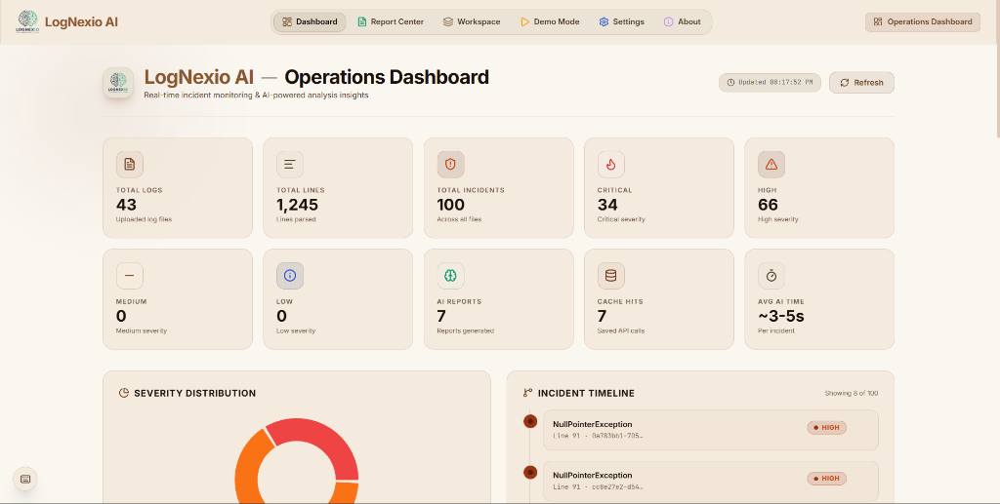
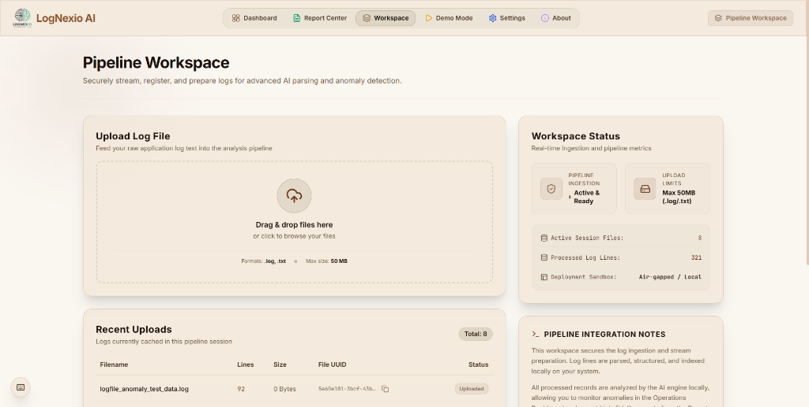
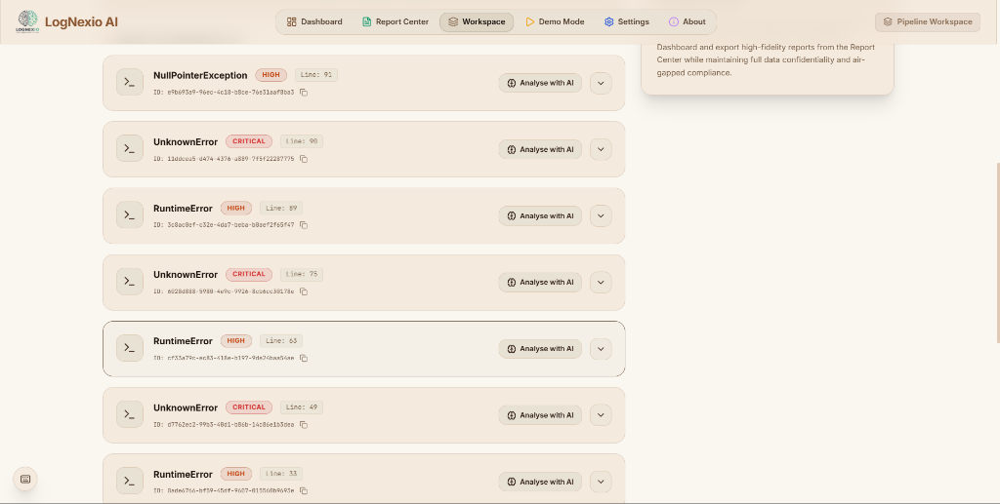
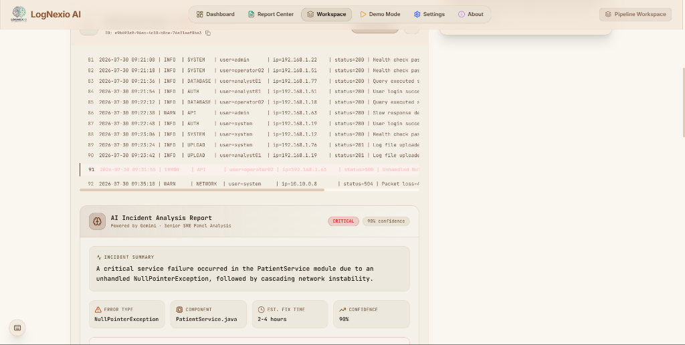
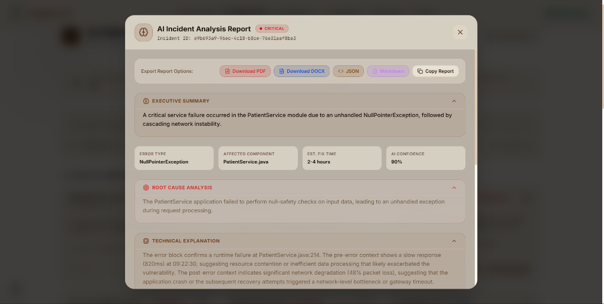

# LogNexio AI — Intelligent Operations Dashboard & Log Analyzer

LogNexio AI is a state-of-the-art, air-gapped operations dashboard and intelligent log analyzer that automatically structures raw application logs, identifies anomalies, and generates comprehensive SRE incident reports locally. Powered by the Gemini API, it provides sub-second diagnostics, resolution guidelines, and interactive log timelines without sacrificing data confidentiality.

---

The live link : https://log-nexio-ai.vercel.app/

---

## 🚀 Key Features
* **Operations Dashboard**: Real-time visualization of log counts, line rates, critical severity incidents, AI analysis times, and error timelines.
* **Workspace Sandbox**: Secure local drag-and-drop file ingestion (`.log` / `.txt`), parser statistics, and real-time compliance notes.
* **Senior SRE AI Panel**: Instantly structures anomalies into root causes, technical code explanation blocks, business risks, and actionable resolution steps.
* **Report Center**: Review and compare previous analyses side-by-side, search incident histories, and export reports in PDF, DOCX, JSON, and Markdown.

---

## 🎨 Visual Preview

### 1. Operations Dashboard

### 2. Workspace Pipeline Upload

### 3. Parsed Error Ingestion List

### 4. Interactive Log Context & AI Stream

### 5. Detailed AI Incident Analysis Drawer

---

## 🛠️ Technology Stack
* **Frontend**: React (Vite compiler), Tailwind CSS, Lucide icons, responsive layouts.
* **Backend**: Python (FastAPI framework), Pydantic (data contract validation), Uvicorn server.
* **AI Analysis**: Google Gen AI SDK (loading `gemini-3.1-flash-lite` on the API key tier).
* **Export Engines**: ReportLab PDF layout generator (sepia-styled header cards, center-aligned brand branding, and A4 layouts), python-docx document creator.

---
