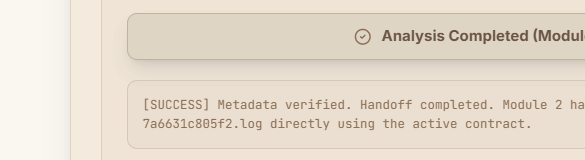
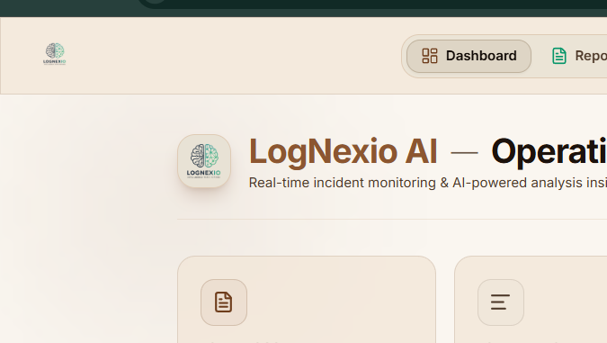
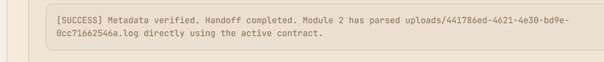

# LogNexio AI — Advanced Log Analysis & Incident Intelligence Platform

LogNexio AI is an advanced, air-gapped log ingestion and anomaly detection platform powered by Google Gemini. It enables DevOps and SRE teams to securely stream raw application logs locally, automatically identify high-fidelity incidents, and generate structured diagnostic reports in seconds.

---

## 📸 Platform Screenshots

### 1. Operations Dashboard
*Real-time incident monitoring metrics, severity distribution charts, and chronologically-sorted event timelines.*


### 2. AI Incident Analysis Report
*Expanded SRE diagnosis card showing root cause analyses, technical explanations, and actionable resolution steps.*


### 3. Log Parsing & Context Stream
*Visual line-by-line log context with highlighting on anomalous line items and direct trigger triggers for AI analysis.*


### 4. Pipeline Ingestion Workspace
*Air-gapped secure log file drag-and-drop ingestion interface displaying upload queues and active session statistics.*


### 5. Ingested Logs Overview
*Workspace history tracking and tabular analysis of recently cached log files.*


---

## 🛠️ Technology Stack

The LogNexio AI platform is architected as a lightweight, performant, and completely local application:

* **Frontend Framework**: React.js (Vite compiler)
* **Styling**: Tailwind CSS & Vanilla CSS (configured for a warm sepia/brown corporate theme)
* **Backend Services**: Python (FastAPI framework + Uvicorn server)
* **AI Orchestration**: Google Gen AI SDK (`google-genai` >= 1.0) using the `gemini-3.1-flash-lite` model for deterministic, low-latency analysis
* **Data Schemas**: Pydantic v2 (strict schema validation contracts)
* **Export Services**: 
  * ReportLab (for customized, sepia-styled PDF reports)
  * python-docx (for Microsoft Word exports)
  * PIL / Pillow (for zero-margin PNG logo formatting)

---

## 🚀 Key Features

* **Real-Time Operations Dashboard**: Instantly track total line counts, incident classifications, critical severity percentages, and average AI analysis latency.
* **Senior SRE Anomaly Detection**: Parses raw log uploads to isolate errors, trace exception call stacks, determine component failures, and estimate resolution time.
* **Unified Multi-Format Export Center**: Download incident reports in one click to beautifully aligned sepia-themed PDF documents, DOCX files, raw JSON responses, or Markdown files.
* **Completely Private & Air-Gapped**: All log parsing, indexing, and report file generation are performed on your local storage (`backend/uploads/`), preventing third-party tracking.
* **Built-in Demo Mode**: Test the pipeline instantly using simulated log streams with predefined anomalies to preview system capabilities.

---

## 🏁 Quick Start

### 1. Clone & Set Up Local Environment Variables
Create a file named `.env` inside the `backend/` directory:
```env
HOST=127.0.0.1
PORT=8000
ENV=development
MAX_FILE_SIZE_MB=50
GEMINI_API_KEY=your_gemini_api_key_here
```

### 2. Start the Application
You can launch both the backend FastAPI server and the Vite frontend dev server simultaneously by running the startup batch script in the project root:
```bash
.\run.bat
```
* **Frontend Access**: `http://localhost:5173/` (or next available port)
* **Backend API Documentation**: `http://127.0.0.1:8000/docs`
